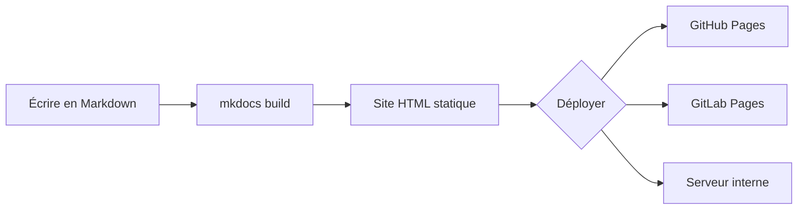
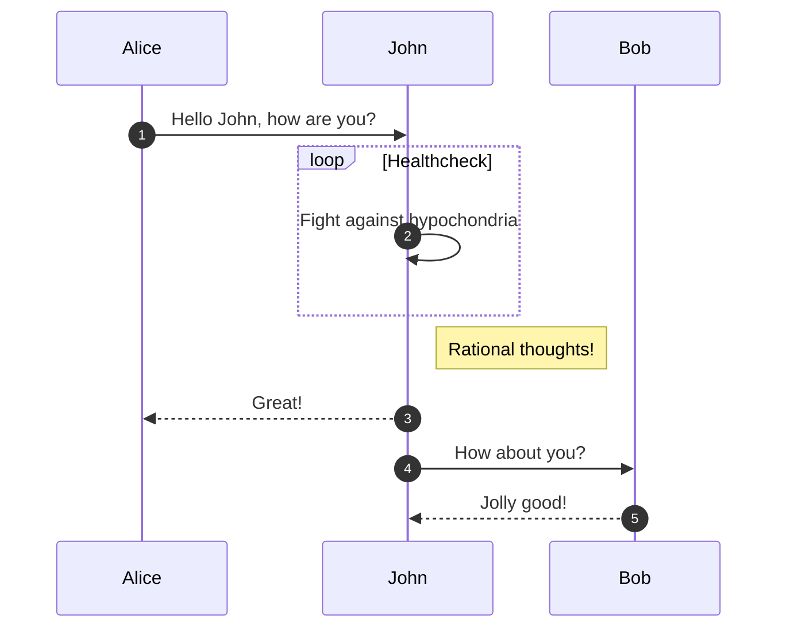
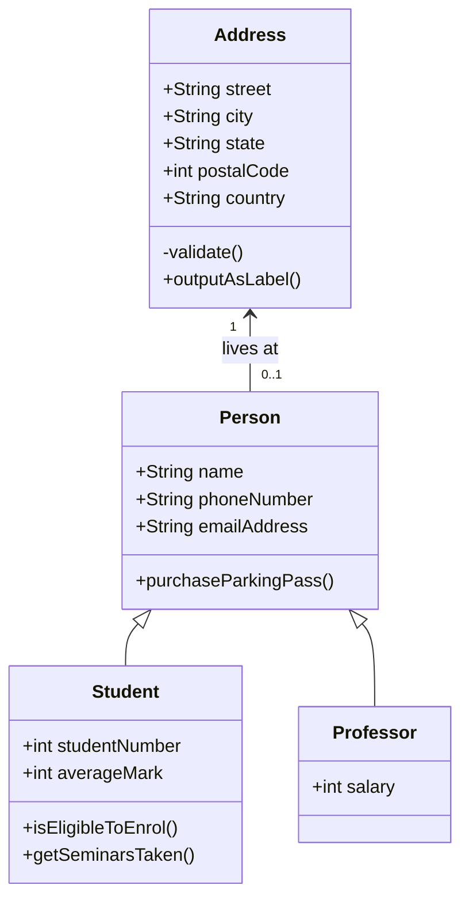

# Mermaid

## Diagramme de flux

```mermaid
graph LR
    A[Écrire en Markdown] --> B[mkdocs build]
    B --> C[Site HTML statique]
    C --> D{Déployer}
    D --> E[GitHub Pages]
    D --> F[GitLab Pages]
    D --> G[Serveur interne]
```

## Diagramme de séquence

``` mermaid
sequenceDiagram
  autonumber
  Alice->>John: Hello John, how are you?
  loop Healthcheck
      John->>John: Fight against hypochondria
  end
  Note right of John: Rational thoughts!
  John-->>Alice: Great!
  John->>Bob: How about you?
  Bob-->>John: Jolly good!
```

## Diagramme de classe

``` mermaid
classDiagram
  Person <|-- Student
  Person <|-- Professor
  Person : +String name
  Person : +String phoneNumber
  Person : +String emailAddress
  Person: +purchaseParkingPass()
  Address "1" <-- "0..1" Person:lives at
  class Student{
    +int studentNumber
    +int averageMark
    +isEligibleToEnrol()
    +getSeminarsTaken()
  }
  class Professor{
    +int salary
  }
  class Address{
    +String street
    +String city
    +String state
    +int postalCode
    +String country
    -validate()
    +outputAsLabel()
  }
```